# PhotoMatch — ERD đề xuất

```mermaid
erDiagram
    USERS ||--|| USER_PROFILES : has
    USERS ||--o{ AUTH_IDENTITIES : authenticates_with
    USERS ||--o{ AUTH_SESSIONS : creates
    AUTH_IDENTITIES ||--o{ PASSWORD_RESET_TOKENS : receives

    USERS ||--o{ USER_ROLES : owns
    ROLES ||--o{ USER_ROLES : assigns
    USER_ROLES ||--o| PHOTOGRAPHER_PROFILES : extends
    USERS ||--|| USER_SETTINGS : configures

    CITIES o|--o{ USER_PROFILES : is_home_city
    USERS ||--o{ USER_LOCATIONS : records
    CITIES o|--o{ USER_LOCATIONS : belongs_to
    USER_ROLES ||--o| DISCOVERY_PRESENCE : publishes
    USER_LOCATIONS o|--o{ DISCOVERY_PRESENCE : uses_current_location

    ROLES ||--o{ ROLE_ACTIVITY_FIELDS : allows  
    ACTIVITY_FIELDS ||--o{ ROLE_ACTIVITY_FIELDS : belongs_to
    USER_ROLES ||--o{ USER_ROLE_FIELDS : selects
    ACTIVITY_FIELDS ||--o{ USER_ROLE_FIELDS : selected_as

    ACTIVITY_FIELDS ||--o{ SERVICES : contains
    USER_ROLES ||--o{ USER_ROLE_SERVICES : offers_or_needs
    SERVICES ||--o{ USER_ROLE_SERVICES : references

    USER_ROLES ||--o{ PORTFOLIO_ITEMS : owns
    SERVICES o|--o{ PORTFOLIO_ITEMS : categorizes

    USER_ROLES ||--o{ DISCOVERY_FILTERS : creates
    ROLES ||--o{ DISCOVERY_FILTERS : targets
    CITIES o|--o{ DISCOVERY_FILTERS : searches_in
    DISCOVERY_FILTERS ||--o{ DISCOVERY_FILTER_SERVICES : includes
    SERVICES ||--o{ DISCOVERY_FILTER_SERVICES : filters_by

    USER_ROLES ||--o{ SWIPES : performs
    USER_ROLES ||--o{ SWIPES : receives
    DISCOVERY_FILTERS o|--o{ SWIPES : generated_from

    USER_ROLES ||--o{ MATCHES : joins_as_side_a
    USER_ROLES ||--o{ MATCHES : joins_as_side_b
    USERS o|--o{ MATCHES : ends
    MATCHES ||--o| CONVERSATIONS : opens

    CONVERSATIONS ||--|{ CONVERSATION_PARTICIPANTS : contains
    USERS ||--o{ CONVERSATION_PARTICIPANTS : participates
    CONVERSATIONS ||--o{ MESSAGES : contains
    USERS ||--o{ MESSAGES : sends
    MESSAGES o|--o{ MESSAGES : replies_to
    MESSAGES ||--o{ MESSAGE_RECEIPTS : has
    USERS ||--o{ MESSAGE_RECEIPTS : receives

    USERS ||--o{ USER_BLOCKS : blocks
    USERS ||--o{ USER_BLOCKS : is_blocked

    USER_ROLES ||--o{ SHOOT_REQUESTS : creates
    SERVICES ||--o{ SHOOT_REQUESTS : requests
    CITIES o|--o{ SHOOT_REQUESTS : located_in

    MATCHES ||--o{ BOOKINGS : results_in
    SHOOT_REQUESTS o|--o{ BOOKINGS : becomes
    USER_ROLES ||--o{ BOOKINGS : books_as_customer
    USER_ROLES ||--o{ BOOKINGS : receives_as_photographer
    SERVICES ||--o{ BOOKINGS : books_service

    BOOKINGS ||--o{ BOOKING_STATUS_HISTORY : has_history
    USERS ||--o{ BOOKING_STATUS_HISTORY : changes
    BOOKINGS ||--o| REVIEWS : receives
    USERS ||--o{ REVIEWS : writes
    USERS ||--o{ REVIEWS : is_reviewed
    USERS o|--o{ REVIEWS : moderates

    USERS ||--o{ NOTIFICATIONS : receives
    USERS o|--o{ NOTIFICATIONS : triggers
    MATCHES o|--o{ NOTIFICATIONS : references
    MESSAGES o|--o{ NOTIFICATIONS : references
    BOOKINGS o|--o{ NOTIFICATIONS : references
    ACCOUNT_PENALTIES o|--o{ NOTIFICATIONS : references

    USERS ||--o{ IDENTITY_VERIFICATIONS : submits

    USERS ||--o{ USER_REPORTS : reports
    USERS ||--o{ USER_REPORTS : is_reported
    USERS o|--o{ USER_REPORTS : resolves
    MATCHES o|--o{ USER_REPORTS : references
    CONVERSATIONS o|--o{ USER_REPORTS : references
    MESSAGES o|--o{ USER_REPORTS : references
    BOOKINGS o|--o{ USER_REPORTS : references

    USERS ||--o{ ACCOUNT_PENALTIES : receives
    USERS ||--o{ ACCOUNT_PENALTIES : imposes
    USERS o|--o{ ACCOUNT_PENALTIES : revokes
    USER_REPORTS o|--o{ ACCOUNT_PENALTIES : leads_to

    LEGAL_DOCUMENTS ||--o{ USER_CONSENTS : accepted_as
    USERS ||--o{ USER_CONSENTS : accepts

    USERS {
        uuid id PK
        varchar email UK
        varchar phone UK
        varchar account_status
        varchar identity_verification_status
        boolean email_verified
        boolean phone_verified
        datetime last_login_at
        datetime created_at
        datetime updated_at
        datetime deleted_at
    }

    AUTH_IDENTITIES {
        uuid id PK
        uuid user_id FK
        varchar provider
        varchar provider_identifier
        varchar password_hash
        varchar status
        datetime last_used_at
        datetime created_at
        datetime updated_at
    }

    AUTH_SESSIONS {
        uuid id PK
        uuid user_id FK
        varchar refresh_token_hash
        varchar device_name
        varchar platform
        varchar ip_address
        datetime expires_at
        datetime revoked_at
        datetime created_at
    }

    PASSWORD_RESET_TOKENS {
        uuid id PK
        uuid auth_identity_id FK
        varchar token_hash UK
        datetime expires_at
        datetime used_at
        datetime created_at
    }

    USER_PROFILES {
        uuid user_id PK, FK
        uuid city_id FK
        varchar display_name
        varchar avatar_url
        text bio
        date date_of_birth
        varchar profile_status
        datetime created_at
        datetime updated_at
    }

    ROLES {
        uuid id PK
        varchar code UK
        varchar name
        varchar status
        datetime created_at
        datetime updated_at
    }

    USER_ROLES {
        uuid id PK
        uuid user_id FK
        uuid role_id FK
        varchar status
        boolean is_primary
        datetime selected_at
        datetime created_at
        datetime updated_at
    }

    PHOTOGRAPHER_PROFILES {
        uuid user_role_id PK, FK
        varchar headline
        varchar working_location
        decimal working_radius_km
        int years_experience
        varchar availability_status
        varchar verification_status
        datetime created_at
        datetime updated_at
    }

    USER_SETTINGS {
        uuid user_id PK, FK
        varchar language
        varchar theme
        varchar map_type
        boolean push_enabled
        boolean location_enabled
        boolean profile_discoverable
        int location_visibility_duration_hours
        datetime created_at
        datetime updated_at
    }

    CITIES {
        uuid id PK
        varchar province_code
        varchar name
        decimal center_latitude
        decimal center_longitude
        varchar status
        datetime created_at
        datetime updated_at
    }

    USER_LOCATIONS {
        uuid id PK
        uuid user_id FK
        uuid city_id FK
        decimal latitude
        decimal longitude
        varchar geohash
        decimal accuracy_meters
        boolean is_current
        datetime captured_at
        datetime expires_at
    }

    DISCOVERY_PRESENCE {
        uuid user_role_id PK, FK
        uuid current_location_id FK
        boolean show_on_map
        boolean show_in_swipe
        boolean available_now
        decimal public_radius_meters
        decimal public_latitude
        decimal public_longitude
        decimal location_noise_meters
        datetime visible_until
        datetime last_active_at
        datetime updated_at
    }

    ACTIVITY_FIELDS {
        uuid id PK
        varchar code UK
        varchar name
        text description
        varchar status
        datetime created_at
        datetime updated_at
    }

    ROLE_ACTIVITY_FIELDS {
        uuid role_id PK, FK
        uuid activity_field_id PK, FK
        boolean is_required
        datetime created_at
    }

    USER_ROLE_FIELDS {
        uuid user_role_id PK, FK
        uuid activity_field_id PK, FK
        datetime selected_at
    }

    SERVICES {
        uuid id PK
        uuid activity_field_id FK
        varchar code UK
        varchar name
        text description
        varchar status
        datetime created_at
        datetime updated_at
    }

    USER_ROLE_SERVICES {
        uuid id PK
        uuid user_role_id FK
        uuid service_id FK
        varchar service_mode
        decimal min_price
        decimal max_price
        varchar currency
        varchar price_unit
        boolean is_active
        datetime created_at
        datetime updated_at
    }

    PORTFOLIO_ITEMS {
        uuid id PK
        uuid photographer_role_id FK
        uuid service_id FK
        varchar media_url
        varchar thumbnail_url
        varchar title
        text description
        int sort_order
        varchar status
        datetime created_at
        datetime updated_at
        datetime deleted_at
    }

    DISCOVERY_FILTERS {
        uuid id PK
        uuid owner_user_role_id FK
        uuid target_role_id FK
        uuid city_id FK
        varchar name
        decimal search_latitude
        decimal search_longitude
        decimal radius_km
        decimal min_price
        decimal max_price
        boolean available_only
        boolean verified_only
        boolean is_default
        datetime created_at
        datetime updated_at
    }

    DISCOVERY_FILTER_SERVICES {
        uuid discovery_filter_id PK, FK
        uuid service_id PK, FK
    }

    SWIPES {
        uuid id PK
        uuid actor_user_role_id FK
        uuid target_user_role_id FK
        uuid discovery_filter_id FK
        varchar direction
        varchar source
        datetime created_at
        datetime updated_at
    }

    MATCHES {
        uuid id PK
        uuid user_role_a_id FK
        uuid user_role_b_id FK
        uuid ended_by_user_id FK
        varchar status
        text end_reason
        datetime matched_at
        datetime ended_at
        datetime created_at
        datetime updated_at
    }

    CONVERSATIONS {
        uuid id PK
        uuid match_id UK, FK
        varchar status
        datetime last_message_at
        datetime created_at
        datetime updated_at
    }

    CONVERSATION_PARTICIPANTS {
        uuid conversation_id PK, FK
        uuid user_id PK, FK
        boolean is_muted
        datetime joined_at
        datetime last_read_at
        datetime left_at
    }

    MESSAGES {
        uuid id PK
        uuid conversation_id FK
        uuid sender_user_id FK
        uuid reply_to_message_id FK
        varchar message_type
        text content
        varchar status
        datetime created_at
        datetime edited_at
        datetime deleted_at
    }

    MESSAGE_RECEIPTS {
        uuid message_id PK, FK
        uuid user_id PK, FK
        datetime delivered_at
        datetime read_at
    }

    USER_BLOCKS {
        uuid blocker_user_id PK, FK
        uuid blocked_user_id PK, FK
        varchar reason_code
        text note
        datetime created_at
    }

    SHOOT_REQUESTS {
        uuid id PK
        uuid customer_role_id FK
        uuid service_id FK
        uuid city_id FK
        varchar title
        text description
        datetime scheduled_start
        datetime scheduled_end
        decimal budget_min
        decimal budget_max
        varchar currency
        varchar address_text
        decimal latitude
        decimal longitude
        varchar visibility
        varchar status
        datetime created_at
        datetime updated_at
        datetime closed_at
    }

    BOOKINGS {
        uuid id PK
        uuid match_id FK
        uuid shoot_request_id FK
        uuid customer_role_id FK
        uuid photographer_role_id FK
        uuid service_id FK
        datetime scheduled_start
        datetime scheduled_end
        varchar address_text
        decimal latitude
        decimal longitude
        decimal agreed_price
        varchar currency
        varchar status
        text cancellation_reason
        datetime created_at
        datetime updated_at
        datetime completed_at
    }

    BOOKING_STATUS_HISTORY {
        uuid id PK
        uuid booking_id FK
        uuid changed_by_user_id FK
        varchar previous_status
        varchar new_status
        text note
        datetime changed_at
    }

    REVIEWS {
        uuid id PK
        uuid booking_id UK, FK
        uuid reviewer_user_id FK
        uuid reviewee_user_id FK
        uuid moderated_by_user_id FK
        int rating
        text comment
        varchar status
        text moderation_reason
        datetime moderated_at
        datetime created_at
        datetime updated_at
    }

    NOTIFICATIONS {
        uuid id PK
        uuid recipient_user_id FK
        uuid actor_user_id FK
        uuid match_id FK
        uuid message_id FK
        uuid booking_id FK
        uuid penalty_id FK
        varchar notification_type
        varchar title
        text body
        boolean is_read
        datetime read_at
        datetime created_at
    }

    IDENTITY_VERIFICATIONS {
        uuid id PK
        uuid user_id FK
        varchar provider
        varchar document_type
        varchar provider_reference
        varchar status
        text rejected_reason
        datetime submitted_at
        datetime verified_at
        datetime created_at
        datetime updated_at
    }

    USER_REPORTS {
        uuid id PK
        uuid reporter_user_id FK
        uuid reported_user_id FK
        uuid match_id FK
        uuid conversation_id FK
        uuid message_id FK
        uuid booking_id FK
        uuid resolved_by_user_id FK
        varchar reason_code
        text description
        varchar status
        text admin_note
        text resolution
        datetime created_at
        datetime updated_at
        datetime resolved_at
    }

    ACCOUNT_PENALTIES {
        uuid id PK
        uuid user_id FK
        uuid report_id FK
        uuid imposed_by_user_id FK
        uuid revoked_by_user_id FK
        varchar penalty_type
        text reason
        varchar status
        datetime starts_at
        datetime ends_at
        datetime created_at
        text revoke_reason
        datetime revoked_at
    }

    LEGAL_DOCUMENTS {
        uuid id PK
        varchar document_type
        varchar version
        varchar content_url
        varchar status
        datetime effective_at
        datetime created_at
        datetime updated_at
    }

    USER_CONSENTS {
        uuid user_id PK, FK
        uuid legal_document_id PK, FK
        varchar ip_address
        datetime accepted_at
    }
```



# Giải thích entity

## Tài khoản và phân quyền

| Entity                  | Vai trò                                                                 |
| ----------------------- | ----------------------------------------------------------------------- |
| `USERS`                 | Thông tin tài khoản cốt lõi, trạng thái hoạt động và trạng thái xác thực danh tính. |
| `AUTH_IDENTITIES`       | Các phương thức đăng nhập như email/password, Google, Apple hoặc provider khác. |
| `AUTH_SESSIONS`         | Quản lý phiên đăng nhập, thiết bị và việc đăng xuất hoặc thu hồi phiên. |
| `PASSWORD_RESET_TOKENS` | Token sử dụng cho luồng quên mật khẩu.                                  |
| `USER_PROFILES`         | Thông tin cá nhân dùng chung như tên, avatar, thành phố và giới thiệu.  |
| `ROLES`                 | Danh mục vai trò như `CUSTOMER`, `PHOTOGRAPHER`, `ADMIN`.               |
| `USER_ROLES`            | Bảng trung gian Many-to-Many giữa tài khoản và vai trò.                 |
| `PHOTOGRAPHER_PROFILES` | Các thông tin chỉ dành cho vai trò thợ ảnh.                             |
| `USER_SETTINGS`         | Ngôn ngữ, giao diện, loại bản đồ và các thiết lập riêng tư.             |

Không tạo bảng `CUSTOMER_PROFILES` riêng vì các thông tin hiện có của người dùng thường đã nằm trong `USER_PROFILES`. Điều này tránh lặp avatar, tên, thành phố và phần giới thiệu.

`USERS.identity_verification_status` là trạng thái xác thực hiện tại của tài khoản. `IDENTITY_VERIFICATIONS` lưu lịch sử từng lần gửi xác thực, provider bên thứ ba và kết quả xử lý.

## Lĩnh vực, dịch vụ và portfolio

| Entity                 | Vai trò                                                                  |
| ---------------------- | ------------------------------------------------------------------------ |
| `ACTIVITY_FIELDS`      | Lĩnh vực hoạt động cấp cao.                                              |
| `ROLE_ACTIVITY_FIELDS` | Quy định mỗi vai trò được phép chọn những lĩnh vực nào.                  |
| `USER_ROLE_FIELDS`     | Những lĩnh vực mà một người đã chọn cho một vai trò cụ thể.              |
| `SERVICES`             | Dịch vụ thuộc một lĩnh vực, ví dụ chân dung, cưới, sự kiện hoặc du lịch. |
| `USER_ROLE_SERVICES`   | Dịch vụ mà vai trò đang cung cấp hoặc đang có nhu cầu.                   |
| `PORTFOLIO_ITEMS`      | Ảnh portfolio của thợ ảnh, có thể gắn với một dịch vụ cụ thể.            |

`USER_ROLE_SERVICES.service_mode` có thể nhận:

* `OFFERED`: dịch vụ do thợ ảnh cung cấp.
* `WANTED`: dịch vụ mà người dùng đang quan tâm.

Cách này giúp cùng một cấu trúc dữ liệu hỗ trợ cả hai phía của marketplace.

## Vị trí và tìm kiếm quanh đây

| Entity                      | Vai trò                                                                     |
| --------------------------- | --------------------------------------------------------------------------- |
| `CITIES`                    | Danh mục tỉnh hoặc thành phố.                                               |
| `USER_LOCATIONS`            | Lưu vị trí GPS hiện tại và lịch sử vị trí nếu cần.                          |
| `DISCOVERY_PRESENCE`        | Xác định một vai trò có xuất hiện trên bản đồ hoặc màn hình quẹt hay không. |
| `DISCOVERY_FILTERS`         | Lưu tiêu chí tìm kiếm như bán kính, giá, thành phố và trạng thái sẵn sàng.  |
| `DISCOVERY_FILTER_SERVICES` | Quan hệ Many-to-Many giữa bộ lọc và dịch vụ.                                |

`USER_PROFILES.city_id` là thành phố cư trú hoặc thành phố khai báo.
`USER_LOCATIONS` là vị trí GPS hiện tại. Hai dữ liệu này có ý nghĩa khác nhau nên không bị xem là trùng lặp.

Vị trí trả về cho người khác không dùng trực tiếp tọa độ GPS thật. `DISCOVERY_PRESENCE.public_latitude` và `DISCOVERY_PRESENCE.public_longitude` là tọa độ công khai đã được làm lệch chủ động trong phạm vi cấu hình. `public_radius_meters` mô tả bán kính công khai hiển thị, còn `location_noise_meters` mô tả mức sai lệch đã áp dụng.

`DISCOVERY_PRESENCE.visible_until` xác định thời điểm hết hiển thị. Giá trị mặc định được tính từ `USER_SETTINGS.location_visibility_duration_hours`, nhưng người dùng có thể chọn một khoảng thời gian hiển thị ngắn hơn cho từng lần bật hiển thị.

Trong triển khai thật, nên dùng PostgreSQL cùng PostGIS với kiểu `geography(Point, 4326)` thay vì chỉ sử dụng hai cột latitude và longitude.

## Quẹt và match

| Entity    | Vai trò                                           |
| --------- | ------------------------------------------------- |
| `SWIPES`  | Lưu hành động bỏ qua, quan tâm, chấp nhận hoặc từ chối. |
| `MATCHES` | Được tạo khi người dùng quan tâm và thợ ảnh chấp nhận.  |

`SWIPES` liên kết tới `USER_ROLES` thay vì trực tiếp tới `USERS`. Vì một tài khoản có thể vừa là người dùng, vừa là thợ ảnh và hành vi quẹt phụ thuộc vào chế độ đang sử dụng.

Luồng match đã chốt:

```text
Customer quan tâm
→ Photographer chấp nhận
→ MATCH
```

Trong MVP, `Customer role RIGHT Photographer role` chỉ tạo tín hiệu quan tâm, chưa mở chat. Khi thợ ảnh bấm chấp nhận, hệ thống tạo `MATCH` và mở `CONVERSATION`. Nếu thợ ảnh từ chối, hệ thống ghi nhận hành động từ chối để không tiếp tục hiển thị cùng một tín hiệu quan tâm.

## Chat và chặn người dùng

| Entity                      | Vai trò                                                                |
| --------------------------- | ---------------------------------------------------------------------- |
| `CONVERSATIONS`             | Cuộc trò chuyện được tạo từ một match.                                 |
| `CONVERSATION_PARTICIPANTS` | Thành viên trong cuộc trò chuyện. Với MVP phải có đúng hai thành viên. |
| `MESSAGES`                  | Nội dung tin nhắn văn bản.                                             |
| `MESSAGE_RECEIPTS`          | Thời điểm tin nhắn được giao và được đọc.                              |
| `USER_BLOCKS`               | Danh sách chặn giữa hai tài khoản.                                     |

Một `MATCH` chỉ có tối đa một `CONVERSATION`. Vì vậy `CONVERSATIONS.match_id` cần unique.

Trước khi gửi tin nhắn, backend cần kiểm tra:

1. Hai người có match còn hiệu lực.
2. Người gửi là thành viên cuộc trò chuyện.
3. Không bên nào đã chặn bên còn lại.
4. Tài khoản không đang bị khóa hoặc đình chỉ.

## Yêu cầu chụp ảnh, đặt lịch và đánh giá

| Entity                   | Vai trò                                  |
| ------------------------ | ---------------------------------------- |
| `SHOOT_REQUESTS`         | Nhu cầu chụp ảnh do khách hàng đăng lên. |
| `BOOKINGS`               | Lịch chụp đã được hai bên thống nhất.    |
| `BOOKING_STATUS_HISTORY` | Lịch sử thay đổi trạng thái booking.     |
| `REVIEWS`                | Đánh giá sau khi booking hoàn thành.     |

`BOOKINGS` có thể được tạo:

* Từ một `MATCH`.
* Từ một `SHOOT_REQUEST`.
* Từ cả hai nếu người dùng đăng yêu cầu rồi match với thợ ảnh.

Chỉ khách hàng được đánh giá thợ ảnh sau khi booking hoàn thành. Không cho phép đánh giá ẩn danh và không cần admin duyệt review trước khi hiển thị. Database nên có unique constraint để mỗi booking chỉ có một review:

```text
UNIQUE (booking_id)
```

## Thông báo, xác thực và xử phạt

| Entity                   | Vai trò                                                           |
| ------------------------ | ----------------------------------------------------------------- |
| `NOTIFICATIONS`          | Thông báo match, tin nhắn, booking hoặc khóa tài khoản.           |
| `IDENTITY_VERIFICATIONS` | Lịch sử gửi và xác minh danh tính tự động qua dịch vụ bên thứ ba. |
| `USER_REPORTS`           | Báo cáo tài khoản hoặc tin nhắn vi phạm.                          |
| `ACCOUNT_PENALTIES`      | Cảnh cáo, khóa tạm thời hoặc khóa vĩnh viễn.                      |
| `LEGAL_DOCUMENTS`        | Các phiên bản điều khoản sử dụng và chính sách bảo mật.           |
| `USER_CONSENTS`          | Ghi nhận người dùng đã đồng ý với phiên bản điều khoản nào.       |

Màn hình phạt hoặc khóa tài khoản được xác định từ:

```text
USERS.account_status
+
ACCOUNT_PENALTIES đang có hiệu lực
```

# Các ràng buộc cần bổ sung trong database

Ngoài PK và FK, nên có các unique constraint sau:

```text
USER_ROLES:
UNIQUE (user_id, role_id)

USER_ROLE_SERVICES:
UNIQUE (user_role_id, service_id, service_mode)

SWIPES:
UNIQUE (actor_user_role_id, target_user_role_id)

MATCHES:
UNIQUE (canonical_user_role_a_id, canonical_user_role_b_id)

CONVERSATION_PARTICIPANTS:
UNIQUE (conversation_id, user_id)

MESSAGE_RECEIPTS:
UNIQUE (message_id, user_id)

USER_BLOCKS:
UNIQUE (blocker_user_id, blocked_user_id)

REVIEWS:
UNIQUE (booking_id)

LEGAL_DOCUMENTS:
UNIQUE (document_type, version)
AT MOST ONE ACTIVE VERSION PER document_type

USER_CONSENTS:
UNIQUE (user_id, legal_document_id)
```

Với `MATCHES`, hai ID cần được chuẩn hóa trước khi lưu:

```text
user_role_a_id = ID nhỏ hơn
user_role_b_id = ID lớn hơn
```

Cách này ngăn hai bản ghi trùng:

```text
A — B
B — A
```

Các ràng buộc nghiệp vụ khác:

* Một người không được swipe, block hoặc report chính mình.
* Chỉ một `USER_LOCATION` được có `is_current = true` cho mỗi user.
* Chỉ một bộ lọc mặc định cho mỗi vai trò và loại đối tượng tìm kiếm.
* Chỉ tài khoản có role `PHOTOGRAPHER` mới được tạo `PHOTOGRAPHER_PROFILES` và `PORTFOLIO_ITEMS`.
* Chỉ booking `COMPLETED` mới được đánh giá.
* Chỉ khách hàng của booking được đánh giá thợ ảnh của booking đó.
* Mỗi booking có tối đa một review; `REVIEWS.booking_id` phải unique.
* Review không được ẩn danh và không cần trạng thái chờ admin duyệt.
* Khi review đổi sang `HIDDEN` hoặc `REMOVED`, phải lưu moderator, lý do và thời điểm moderation; Admin không sửa rating/comment.
* Rating phải nằm trong khoảng 1–5.
* Mỗi `LEGAL_DOCUMENTS.document_type` chỉ có tối đa một version `ACTIVE`; `(document_type, version)` phải unique và version active/effective không được sửa đè.
* `min_price` không được lớn hơn `max_price`.
* `scheduled_end` phải sau `scheduled_start`.
* Mỗi booking phải tham chiếu đúng một match; Customer direct booking tạo hoặc tái sử dụng match và conversation trước khi tạo booking `PENDING` trong cùng transaction.
* Unmatch không xóa match/conversation; phải lưu `ended_at` và actor/reason khi có, đồng thời giữ lịch sử read-only.
* Vị trí hiển thị công khai phải được làm lệch chủ động, không trả về GPS chính xác.
* Vị trí hiển thị tự động hết hạn theo `visible_until`; thời lượng mặc định do người dùng cấu hình.

# Giả định thiết kế

1. Một tài khoản có thể đồng thời là người dùng thường và thợ ảnh.
2. Người dùng chuyển đổi giữa các vai trò trong ứng dụng.
3. Trang cá nhân cơ bản dùng chung giữa các vai trò.
4. Portfolio chỉ thuộc vai trò thợ ảnh.
5. Chỉ người bật `show_on_map` hoặc `show_in_swipe` mới xuất hiện trong phần khám phá.
6. Thợ ảnh nhìn thấy toàn bộ người dùng đã bật hiển thị phù hợp với ngữ cảnh bản đồ hoặc quẹt.
7. Chat chỉ được mở sau khi có match.
8. Một cặp match có một conversation nhưng có thể phát sinh nhiều booking.
9. Booking và Customer review Photographer sau booking `COMPLETED` đều thuộc phạm vi MVP.
10. VNeID không nằm trong MVP. Nếu cần sau này, VNeID chỉ là một provider trong nhóm identity verification.
11. Tất cả tài khoản cần xác thực danh tính, thực hiện tự động thông qua dịch vụ bên thứ ba.
12. Điều khoản sử dụng và chính sách bảo mật có phiên bản để có thể yêu cầu người dùng chấp nhận lại khi nội dung thay đổi.

# Các quyết định đã chốt

## Cơ chế match

Người dùng quẹt phải để thể hiện quan tâm; thợ ảnh bấm chấp nhận để tạo match. Ngoài ra, Customer direct booking cũng tạo hoặc tái sử dụng match và conversation atomically trước khi tạo booking `PENDING`. Chat chỉ được mở sau khi match được tạo theo một trong hai luồng.

## Thợ ảnh nhìn thấy gì?

Thợ ảnh nhìn thấy toàn bộ người dùng đã bật hiển thị. Điều kiện hiển thị phụ thuộc vào `DISCOVERY_PRESENCE.show_on_map`, `DISCOVERY_PRESENCE.show_in_swipe` và thời hạn `visible_until`.

## Quyền riêng tư vị trí

* Hiển thị vị trí có sai lệch chủ động, không trả về GPS chính xác.
* Vị trí tự động hết hạn sau số giờ do người dùng cấu hình trong `USER_SETTINGS.location_visibility_duration_hours`.
* Người dùng được phép bật hiển thị trong một khoảng thời gian nhất định; giá trị cụ thể được lưu bằng `DISCOVERY_PRESENCE.visible_until`.

## Booking

Customer có thể đặt lịch trực tiếp cho Photographer mà không cần match trước. Hệ thống tạo hoặc tái sử dụng đúng một active match và conversation, sau đó tạo booking `PENDING` cùng initial status history trong một transaction. Photographer chỉ được chủ động tạo booking từ active match/conversation.

Booking có các trạng thái:

```text
DRAFT
PENDING
ACCEPTED
REJECTED
CANCELLED
IN_PROGRESS
COMPLETED
DISPUTED
```

## Đánh giá

* Chỉ khách hàng đánh giá thợ ảnh.
* Không cho phép đánh giá ẩn danh.
* Không cần admin duyệt review.

## Xác thực danh tính

* VNeID không nằm trong MVP.
* Tất cả tài khoản cần xác thực.
* Xác thực tự động thông qua dịch vụ của bên thứ ba.

# Những màn hình không cần bảng riêng

Các màn hình sau chủ yếu là giao diện hoặc dữ liệu tĩnh nên không cần entity độc lập:

* Splash.
* Đăng nhập.
* Đăng ký.
* Quên mật khẩu.
* About application.
* Chọn loại bản đồ.
* Giao diện sáng hoặc tối.
* Giới thiệu bạn bè nếu chỉ sử dụng chức năng chia sẻ link.

Nếu cần theo dõi referral và thưởng giới thiệu, nên bổ sung bảng `REFERRALS`.
